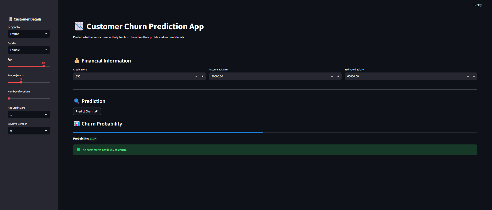

# 📉 Customer Churn Prediction using ANN

An end-to-end **Customer Churn Prediction** project built using **Artificial Neural Networks (ANN)** and deployed as an interactive **Streamlit web application**. The app predicts whether a customer is likely to churn based on demographic and financial information.

🔗 **Live Application**:  
https://customerchurnpredictionappann-rc6wcfeaz4vj7eorvirqdo.streamlit.app/

---

## 📌 Problem Statement
Customer churn is a major challenge in the banking sector. This project aims to predict customer churn in advance so that retention strategies can be implemented proactively.

---

## 📊 Dataset Overview
The dataset contains customer banking information with the following features:

- CreditScore  
- Geography  
- Gender  
- Age  
- Tenure  
- Balance  
- NumOfProducts  
- HasCrCard  
- IsActiveMember  
- EstimatedSalary  
- Exited (Target Variable)
  
---

## ⚙️ Data Preprocessing
- Removed irrelevant columns: `RowNumber`, `CustomerId`, `Surname`
- Encoded categorical features:
  - Gender → Label Encoding
  - Geography → One-Hot Encoding
- Split data into training and testing sets (80/20)
- Feature scaling using `StandardScaler`
- Saved encoders and scaler for deployment

---

## 🧠 Model Architecture (ANN)
- Input Layer
- Hidden Layer 1: Dense (64 neurons, ReLU)
- Hidden Layer 2: Dense (32 neurons, ReLU)
- Output Layer: Dense (1 neuron, Sigmoid)

**Model Details:**
- Optimizer: Adam  
- Loss Function: Binary Crossentropy  
- Metric: Accuracy  
- Early Stopping applied  
- TensorBoard used for monitoring

---

## 🔍 Hyperparameter Tuning
Hyperparameter tuning was performed using **GridSearchCV** with `KerasClassifier`.

**Tuned Parameters:**
- Neurons: 16, 32, 64, 128
- Hidden Layers: 1, 2
- Epochs: 50, 100

**Best Configuration:**
- Neurons: 16  
- Hidden Layers: 1  
- Epochs: 100  
- Accuracy: ~85.8%

---

## 🌐 Streamlit Web Application
The trained model is deployed using **Streamlit**, allowing users to:
- Enter customer details interactively
- Get real-time churn probability
- View churn / non-churn prediction results

---

## 🖼️ Application Screenshots

---

## 🛠️ Tech Stack
- Python
- TensorFlow / Keras
- Scikit-learn
- Pandas
- NumPy
- Streamlit
- Matplotlib
- Scikeras

---

## 🚀 Deployment
- Platform: Streamlit Cloud  
- Python Version: 3.10  
- Model Format: `.h5`

---

## ▶️ Run Locally
git clone https://github.com/your-username/customer_churn_prediction_app_ann.git
cd customer_churn_prediction_app_ann
pip install -r requirements.txt
streamlit run app.py

## 👨‍💻 Author & Contact

**Souvik Karmakar**  
📞 Contact: 8328733447  
📧 Email: karmakarsouvik8328@gmail.com

